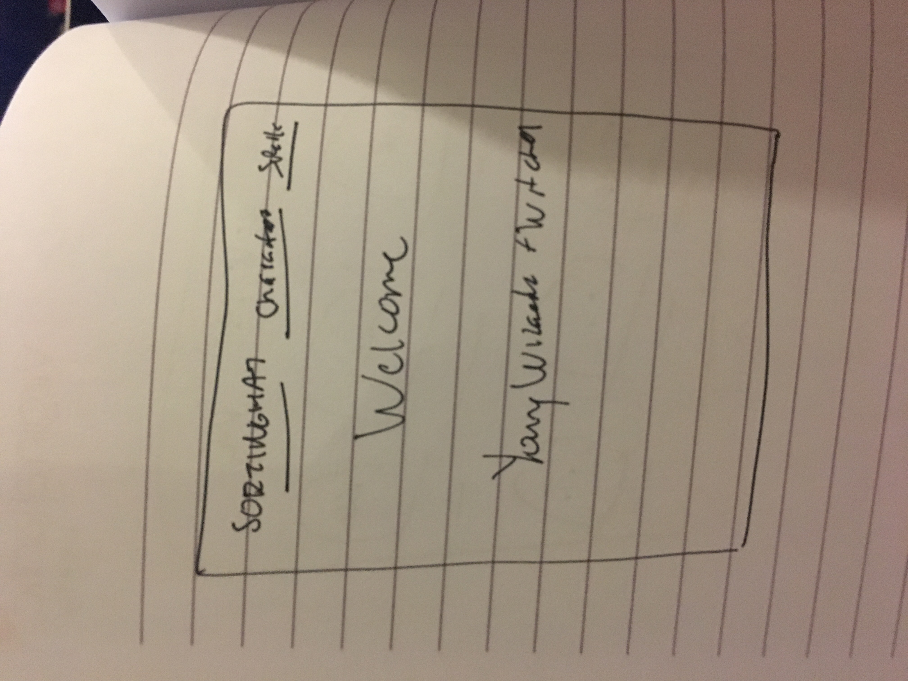
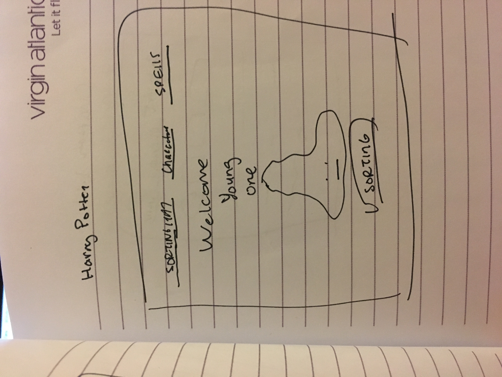
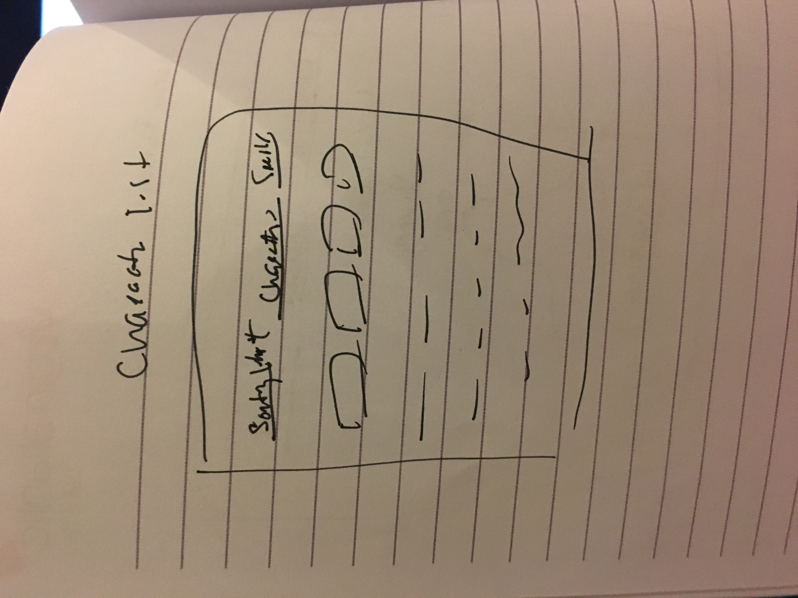
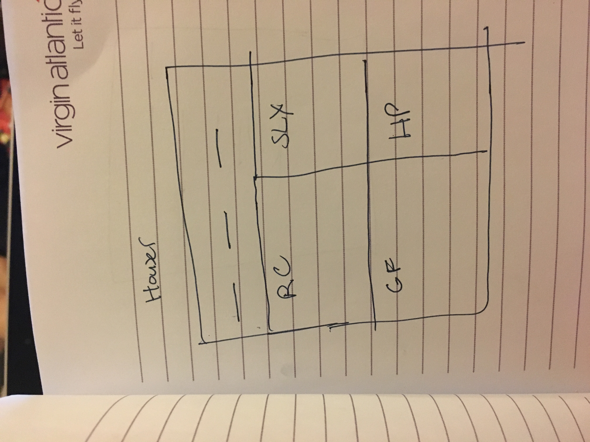
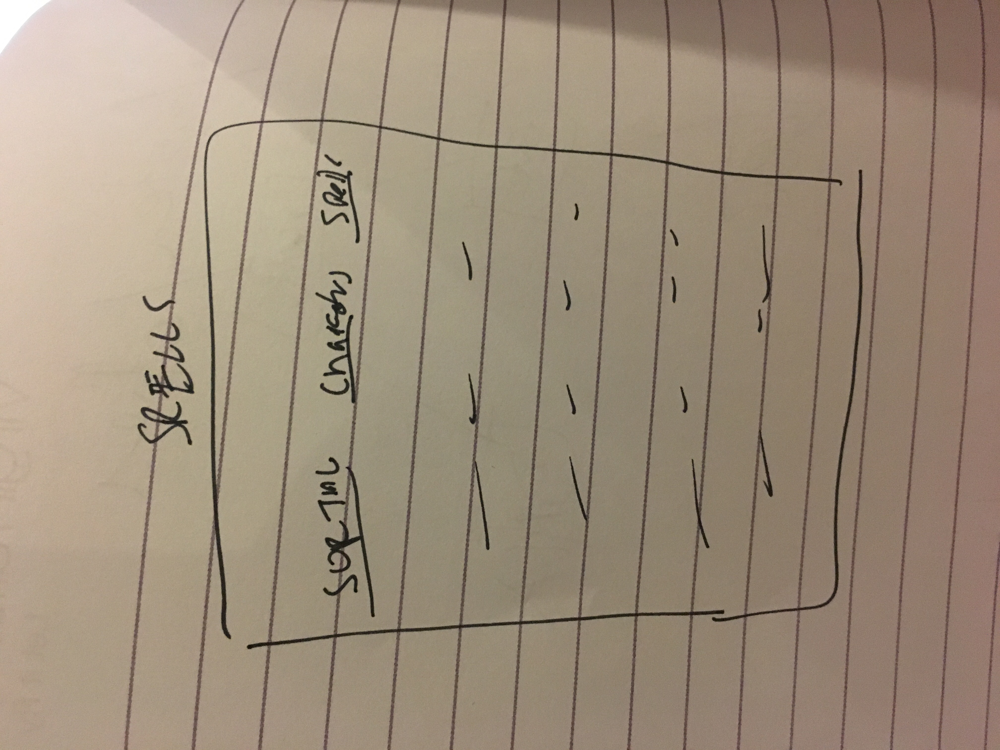

This project was bootstrapped with [Create React App](https://github.com/facebook/create-react-app).  

# HARRY POTTER
[Harry Potter Website](http://defiant-alley.surge.sh/)  
This project is built using React and the [Harry Potter API](https://www.potterapi.com/)  
This app will allow the user to look at the houses,characters, and spells within the Harry Potter Universe.  
User's will be able to view which Hogwarts house they are in.  

## Video Presentation  
[Video](https://www.youtube.com/watch?v=HLxAoxJK8hQ&feature=youtu.be)  

## Wireframes:

## Components being used
1. Welcome
2. Nav
3. SortingHat
4. Houses
5. Characters
6. CharacterList
7. GryffindorStudents
8. HufflepuffStudents
9. RavenclawStudents
10. SlytherinStudents
11. Spells
12. Music

## Links used to help create this website
1. [Pictures](https://www.pottermore.com/)
2. [CSS Animations](http://animista.net/)
3. [Music](https://storage.googleapis.com/media-session/elephants-dream/the-wires.mp3)

Tasks for Wed 11/14: Add a search bar.  
Tasks for Thur 11/15: Look at spells and build game?  
Tasks for Fri 11/16: Styling.  
Tasks for Sat 11/17: Add background music?  
Tasks for Sun 11/18:.
